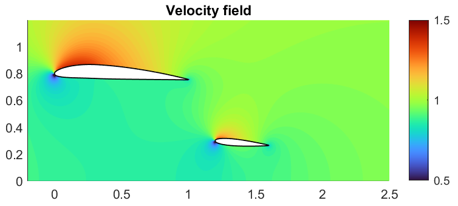

# 2D-CFD-with-Hess-Smith

[](https://matlab.mathworks.com/open/github/v1?repo=lucapiombo/2D-CFD-with-Hess-Smith)

This MATLAB project implements a numerical methodology based on the **Hess-Smith panel method** for analyzing the aerodynamic behavior of two airfoils arranged in a tandem configuration. The study investigates the aerodynamic interaction between the airfoils, including the influence of ground proximity (*ground effect*).  
The numerical results are validated against benchmark data exported from **XFLR5**.

An exmple of the output is shown below:


> **Note:**  
> This code was developed for personal learning and demonstration purposes. It has not been fully optimized and should be treated as a reference for panel method implementation.

---

## 📂 Project Structure

The repository is organized as follows:

- **Main Scripts**
  - `mainSingle.m`: Single airfoil test case.
  - `mainTandem.m`: Tandem configuration (two airfoils).
  - `mainTandemGround.m`: Tandem configuration with ground effect.
- **`functions/`**: Reusable MATLAB functions implementing core numerical routines.
- **`data/`**: Contains validation `.txt` files exported from XFLR5.
- **`results/`** (optional): Generated output files and plots (if saved).

---

## 📊 Validation Data

The `data/` folder includes `.txt` files with pressure coefficient data for validation, corresponding to:
- NACA 0012 airfoil
- Angles of attack: 0° and 2.5°

You can compare your computed results to these XFLR5 datasets to verify accuracy.

---

## 🚀 Getting Started

1. **Clone the repository**
   ```bash
   git clone https://github.com/lucapiombo/2D-CFD-with-Hess-Smith.git
   
---

##🤝 Contributing
Feel free to fork this repository and modify or extend the code for your own research or learning.
If you find issues or have suggestions for improvement, please open an issue or submit a pull request.

---

## 📄 Licence
This project is licensed under the **MIT License**.  
See the [LICENSE](LICENSE) file for details.
